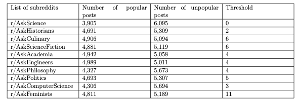
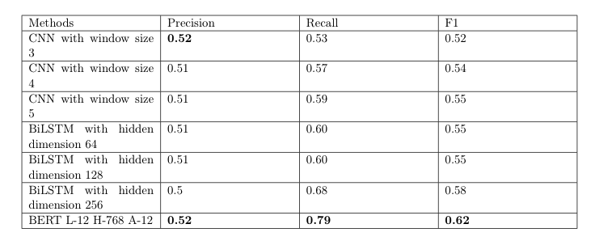

# BMI733

## Overiew

In this project we investigate on "popularity" of questions on Reddit. We use number of comments to define "popularity" of questions. We pick 10 most active 
subreddits and choose the threshold for each subreddit such that the proportions of popular and unpopular posts are closest to fifty-fifty.  It is tabulated as
below: 

Note the threshold in the table is included in the unpopular posts. For example, in r/AskHistorians, the post with number of comments ≤ 2 is classified as unpopular and the post with number of comments ≥ 3 is classified as popular.

We classify each post as either popular or unpopular based on its threshold and gather 100,000 posts with labels 1 (popular) and 0 (unpopular). There are 10 topics in total and 10,000 posts from each topic. We divide 100,000 questions into 80,000 training examples and 20,000 testing examples. 20,000 testing examples are exactly the same for all 3 methods and we do not touch the testing dataset at all during the training.

## Methods

This is a binary classification task to predict popularity of questions. We use 3 methods to predict whether a post is popular or unpopular based on its title question: Convolutional Neural Network (CNN), Bidirectional Long Short-Term Memory (BiLSTM) which is a Recurrent Neural Network (RNN) architecture, and Bidirectional Encoder Representations from Transformers (BERT).

### CNN&RNN

The coding is in CNN&RNN.ipynb. You can choose whether to use CNN or RNN. Please use 

https://drive.google.com/file/d/1Cdlw0XFNukkOMhIAewTuvshF5KbRuBs4/view?usp=sharing

to download pre-trained embeddings for training and testing set. We use word2vec model trained from the Wikipedia corpus.

CNN hyperparameters to tune: Max window size, pre-trained embeddings / random embeddings, number of filters, batch size, max number of epochs, early stopping patience, drop out rate.

RNN hyperparameters to tune: Pre-trained embeddings / random embeddings, number of hidden dimension, batch size, max number of epochs, early stopping patience, drop out rate.

### BERT

The coding is in BERT.ipynb. Please use 

https://drive.google.com/file/d/1P8bltltW85DjkT2AAnU5ugdFptK_KpMO/view?usp=sharing

to download training and testing set suitable to run for BERT.

BERT hyperparameters to tune: Initial learning rate, batch size, max number of epochs, early stopping patience.

## Results

As we see, BERT has the best performance among all 3 methods.

## Conclusion

In this project, we scraped 100,000 title questions from 10 different topics. We used number of comments as our gold label to classify whether a title question belonging to some topic is popular or not. Then we chose thresholds to classify popularity in 10 topics and did a binary classification using 3 methods: CNN, BiLSTM and BERT. We found BERT reached the best performance among all 3 methods.

There are some limitations in our project: First of all, our dataset consists of title questions which are usually very short. Short text classification is one of the most important tasks in natural language processing. Unlike paragraphs or documents, short texts are usually more ambiguous since they have not enough contextual information, so this makes our project very challenging. Second, there are some features which may be very important but we haven’t utilized in the project: supplementary descriptions to title questions, whether the post contains pictures/videos or not, content of pictures/videos, or even the time of posting may be an important feature (probably a post published at 3am won’t receive many comments), etc. If we include those features in our future work, we believe it will help the model have a better understanding of the title question and make a better prediction.
